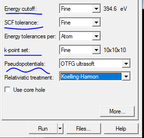
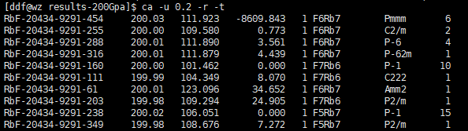

# Airss 操作流程

## 一、结构搜索

### 1. 生成文件

例：`gencell 10 1 Rb 1 F 1`

（10，1，1这些参数可以后改，先创建.cell文件即可）

依次为：
- gencell：产生文件命令
- 10：预设体积
- 1：倍胞
- Rb，F：组成化合物的元素名
- 1，1：各元素占比

然后就会产生两个文件 `*.cell` 和 `*.param`

### 2. 编辑文件

#### （1）*.cell

```
%BLOCK LATTICE_CART
2.714416 0 0
0 2.714416 0
0 0 2.714416
```
对角线数值为体积立方根

```
#VARVOL=20
```
体积，在 https://uspex-team.org/online_utilities/volume_estimation/ 搜索体积

```
%BLOCK POSITIONS_FRAC
Rb 0.0 0.0 0.0 # Rb1 % NUM=0-7
F 0.0 0.0 0.0 # F1 % NUM=0-7
%ENDBLOCK POSITIONS_FRAC
```
NUM为分子式中各原子数

```
##SPECIES=Rb,F
##NATOM=3-9
##FOCUS=2
```
双#号代表注释，如果只保留一个#可使其生效

第一项为元素种类，第二项为总原子个数，第三项如果生效则预测包含单质的结构，使用第二项可以删掉前面整个%BLOCK LATTICE_CART参数

#### （2）*.param

```
cut_off_energy : 0 eV
```

截断能：将生成的.cell文件拖入Vesta，再导出为.cif文件拖入Material Studio，注意必须英文路径。选择三个波浪线的图标Calculation-Electronic，选项

<div align="center">

</div>

Energy cutoff，SCF tolerance, k-point set三项选择Fine

Pseudopotentials选On the Fly 或OTFG ultrasoft

然后看Energy cutoff旁边的数值，这个数值即为`*.param`，cut_off_energy的数值

在资源允许的情况下，实际计算时一般倾向于比那个数高一点，数值越高相应的精度越高，但计算速度会越慢。

使用MS还可以做Encut测试：
build→symmetry→find symmetry→点开之后点新窗口里的find symmetry→impose symmetry

### 3. airss.pbs

可以从别人的工作区里面拷贝做修改（建议），也可以自己建，但不同服务器略有不同，例：

超算中心：
```bash
#!/bin/bash
#PBS -N castep
#PBS -l nodes=1:ppn=28
#PBS -j n
#PBS -q CT2
#PBS -e ${PBS_JOBNAME}.err
#PBS -o ${PBS_JOBNAME}.out
cd $PBS_O_WORKDIR
airss.pl -pressure 200 -mpinp 28 -max 500 -keep -seed RbF >> log
```

### 4. 结果分析

#### 定胞：

```bash
ca -u 精度 -r -t
```

<div align="center">

</div>

最后找到相应结构用Xftp或Winscp导出

**注意**：精度一般在0.1 - 0.5之间都可以，至于选几个结构做高精度优化，这个没法给出个统一数字，看他们之间的焓差是多少，0.5eV以内是应该考虑的。

- 第一列是 AIRSS 软件分配给该结构的名称标签
- 第二列压力值 (GPa)
- 第三列是每个化学式结构单元 (fu) 的体积
- 第四列第一行是一个化学式结构单元 (fu) 的焓值，之后的几行是不同结构下相对于第一行的焓值
- 第五列是单胞中化学式结构单元 (fu) 的总个数 (单胞中 fug 的个数乘以一个 fug 中 fu 的个数)
- 第六列是化学式结构单元 (fu) 的化学式
- 第七列是空间群名称
- 第八列是所有搜索结果中出现该结构的次数

如果您认为所列结果过多，可以使用-u 选项，但是要注意，-u 一定要排在-r之前使用

#### 变胞：

```bash
ca -R -m  # 如果在子文件夹下加-R，根目录下不加
```

列出落在凸包图上结构的命令：

定胞：
```bash
ca -r -de 0
```

变胞：
```bash
ca -m -de 0
```
（后面的0是精度，如果输入0.1就是列出误差在0.1内的点）

画凸包图：
```bash
xmgrace hull.agr  # 需要安装xmgrace
```

## 补充命令

```bash
ca -m -de 0.05 --delete  # 列出离凸包图0.05的点，并删掉其余.res文件
```

### 结构优化后：

1. 把airss结构搜寻到的res文件拷到另外一个新的文件夹下test

2. 然后输入`ca -m -de 0.04 -r --delete`，删除单个原子能量差大于0.04eV的res文件，0.04这个值要根据实际情况变化

3. 把结构搜索的cell和param文件拷到这个新文件夹里test，把cell的K点提高，加上压力，param文件的截断能提高

4. 用命令`run.pl -mpinp 8 -keep`就可以连续计算文件夹test的所有结构

5. 比较这几个结构的焓值，最低的焓值是最稳定的结构

### 其他常用命令：

先建立tmp文件夹

```bash
ca -m -de 0.05 |awk '{print $1".res"}' |xargs cp -t tmp/
```
只把配比最稳定的列出然后拷贝入tmp文件夹

```bash
ca -f *** -r -t|awk '{print $1".res"}' |xargs cp -t tmp/
```
找某个配比的前十个稳定结构然后拷贝入tmp文件夹

```bash
ca --m | sort --n --k 6 --k 5
```

```bash
pestat  # 查看正在执行的任务
```