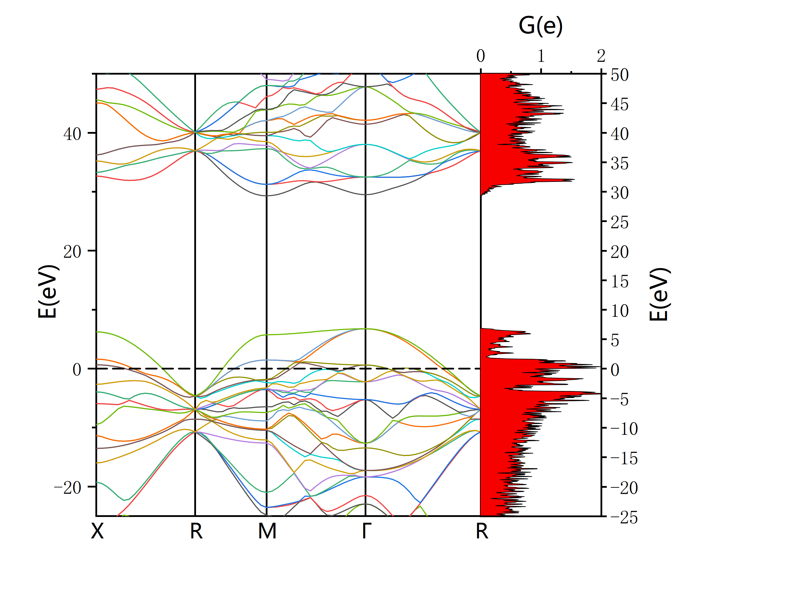
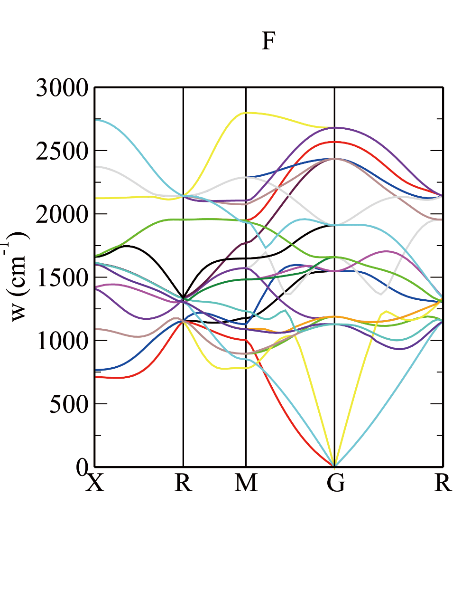

# CASTEP 操作流程

**林子越**

## 一、基础与原子结合

(cif转cell 首先用MS打开.cif输出.res文件，然后在终端输入以下命令

```bash
cabal res cell < xxx.res > xxx.cell
```

只输入cabal 会显示可以用于转换的文件类型，但不能从cif转为cell

经过上述转换得到的.cell文件是不完整的)

得到完整.cell文件的做法是：将.cif文件用MS打开，点三个波浪线图标-Calculation-Files-Save Files即不运行将结果保存在工作目录下，默认位置为：文档-Materials Studio Projects-保存的某project下，但.cell文件为隐藏文件，需点击菜单-勾选"隐藏的项目"即可显示。

### I. 准备文件：

- *.usp #赝势文件（可以在.cell文件中以下方BLOCK SPECIES_POT形式给出）
- *.cell
- *.param
- castep.pbs.sh #declare seed_name='*'（与*.cell文件名称相同）

#### 1) *.cell

LATTICE_CART和POSITIONS_FRAC这两项

还需要添加以下3项

```
kpoint_mp_grid 12 12 12 或 KPOINTS_MP_SPACING : 0.02
#给出具体K点间隔 注意从MS里导出的结构若自带k点，此项不设！

SYMMETRY_GENERATE

%BLOCK SPECIES_POT
  F 2|1.0|20|23|26|20:21(qc=8)
  给出具体物质的赝势，若同文件夹下给出.usp赝势文件，此项不加
%ENDBLOCK SPECIES_POT
```

#### 2) *.param

<div align="center">

</div>

在*.param文件里加入这两行即可输出.cell和.cif文件

```
WRITE_CIF_STRUCTURE : true
WRITE_CELL_STRUCTURE : true
```

注意basis_precision 不能与cut_off_energy 并存，只能选择一个，否则报错

另：spin_polarized 如果此项默认为false 计算后错误文件.err可能提醒要改为true，原因是.cell文件晶格参数加了自旋(spin)，注意有磁性的物质才加自旋，初始磁矩可能是不合理的。

如果.cell文件里加自旋，这里写true，未加写false

### II. 提交脚本

**Notes:**

后续步骤（能带、态密度等）使用以下简单脚本即可

```bash
#!/bin/bash
#PBS -q CT2                    #设置节点
#PBS -l nodes=1:ppn=20         #ppn=核心数
#PBS -j oe
#PBS -V
#PBS -N F_PBE_phonon           #任务名
#######################################
####### Basic Parameter Declare #######
cd $PBS_O_WORKDIR
mpirun -n 20 castep phonon > log    #phonon=文件名，依输入文件名称定
#-n 20 ppn乘nodes
```

### III. 输出文件：OUT.cell，OUT.castep，拖入VESTA可查看结构

## 二、几何优化（单压力点优化）

### 1. 准备文件

#### 1) .cell文件

#### 2) .param文件

任务名改为 geometry optimisation

#### 3) castep.pbs

可以在脚本或cell文件中给出压力

在.cell文件中注明优化压力，格式如下

```
%BLOCK EXTERNAL_PRESSURE
50 0 0
   50 0
      50
%ENDBLOCK EXTERNAL_PRESSURE
```

*.param :

```
task : geometry optimisation
xc_functional : PBE
cut_off_energy : 900 eV
fix_occupancy : false          绝缘体选true
opt_strategy : speed
num_dump_cycles : 0
MAX_SCF_CYCLES : 100
```

**Notes:**

可以使用 `castep2res XXX.OUT > YYY.res` 命令将结果转化为.res文件

可能的常见错误是

Error check_elec_ground_state : electronic_minimisation of initial cell failed

将MAX_SCF_CYCLES的值提高，比如提高到100即可

## 三、能带

（在用某软件做能带、态密度、声子谱之前，需要先用该软件进行结构优化）

### I. 准备文件：

- *.cell （如在同文件夹下尽量与之前文件名不同）
- *.param
- castep.pbs.sh

#### 1) *.cell

除Basics & Bonding中.cell的数据外，还需加入布里渊区高对称点路径:

<div align="center">

</div>

具体操作如下：

将.cell文件用Xftp导出，用Vesta打开，Files – Export Data 输出.cif文件，再用Material Studio 打开.cif文件，选菜单栏中的Build – Symmetry – Find Symmetry 点选Find Symmetry按钮，出现数据后点左下角 Impose Symmetry即完成对称性导入

然后选菜单栏中的Tools – Brillouin Zone Path 点选 Create，产生下图路径

<div align="center">

</div>

先从上至下，再从左至右依次以上面图中格式在.cell文件中输入Brillouin Zone Path

需要注意的是，对角有重复的点要省略

```
! Specify a path through the IBZ.
%block bs_kpoint_path
  0.500 0.000 0.000 ! X
  0.500 0.500 0.500 ! R
  0.500 0.500 0.000 ! M
  0.000 0.000 0.000 ! G
  0.500 0.500 0.500 ! R
%endblock bs_kpoint_path
```

#### 2) *.param：

<div align="center">

</div>

任务名改为bandstructure

xc_functional 选所需赝势，basis_precison与之前同理不能与cut_off_energy共存

POPN_BOND_CUTOFF : 5 ang 如果需要设置获取键长范围可以加入这一条

#### 3) castep.pbs.sh 格式

```bash
#!/bin/bash
#PBS -q CT2
#PBS -l nodes=1:ppn=20
#PBS -j oe
#PBS -V
#PBS -N F_PBE_DOS
#######################################
####### Basic Parameter Declare #######
cd $PBS_O_WORKDIR
mpirun -n 20 castep F > log
```

### II. 执行castep.pbs

注意拿来的castep.pbs脚本中可能存在rm .bands的词条，加上之后会自动删除输出的bands文件，删除此项

### III. 得到结果并画图

**画图方法1：**

运行成功后会输出xxx.bands文件

执行命令：

```bash
dispersion.pl -xg -bs -symmetry XXX xxx.bands
```

-symmetry后面给出的是对称性，如果不加具体对称性，给出的能带图横坐标会是 -1/2 0 1/2 这样的数字（输入的小数会化成分数）

如何查找结构的对称性：

1. 将*.cell 用Vesta-Export Data转化为.cif文件，将.cif文件导入MS，Build-Symmetry-Show Symmetry (未加对称性的先Find Symmetry) 既可以看到

上图中的Crystal System

<div align="center">

</div>

所对应的晶系Cubic则在-symmetry后面加上-cubic 即可最后得到如下图的能带图：

<div align="center">

</div>

```bash
dispersion.pl -xg -bs -symmetry cubic F.bands
```

**画图方法2：**

Origin 作图：详情见Origin Walkthrough

## 四、态密度（DOS）图

### I. 准备文件

（注意画能带图的结果不能用于画态密度图，需要重新提交任务）

#### 1) *.cell

需要包含

LATTICE_CART和POSITIONS_FRAC这两项

```
! Kpoint grid for the Groundstate (SCF) calculation
KPOINTS_MP_SPACING : 0.02
SYMMETRY_GENERATE

! Kpoint grid for a DOS plot
BS_KPOINTS_MP_SPACING : 0.02    画dos图的K点间隔
```

但不能加高对称点布里渊路径

#### 2) .param与bandstructure相同

### II. 提交脚本

dos.pl -gp *.bands 使用gunplot画图，dos.pl

<div align="center">

</div>

```bash
dos.pl -gp F.bands
```

dos.pl -xg *.bands

<div align="center">

</div>

**Notes:**

1. dispersion.pl 和 dos.pl 后面加-h可列出可用的选项

```bash
dos.pl -h
```

<div align="center">

</div>

2. 除dos.pl -gp *.bands或dos.pl -xg *.bands直接用xmanager画图的方法外

dos.pl 直接加 *.bands则为列出画图需要的数据，

dos.pl *.bands > *.txt则可以输出为可以用Origin画图的.txt文件

详情见Origin Walkthrough（图为整合了能带图的态密度图）

<div align="center">

</div>

*Plot by Origin*

## 五、声子谱的计算

### I. 准备文件

#### 1) *.cell

需要包含

```
%BLOCK LATTICE_CART
%BLOCK POSITIONS_FRAC    #与之前相同
%BLOCK SPECIES_POT        #赝势（可用文件或者直接输入）
```

此外还需加入以下内容（之前画DOS和态密度的参数不留）

<div align="center">

</div>

**1.%block phonon_fine_kpoint_path**

是声子的q-vector path（Q矢量路径），在新版MS中名为Dispersion path

以下是获取该路径的操作流程：

**a.导入对称性**

将优化过的.cell文件用Xftp导出，用Vesta打开，Files – Export Data 输出.cif文件，再用Material Studio 打开.cif文件，选菜单栏中的Build – Symmetry – Find Symmetry 点选Find Symmetry按钮，出现数据后点左下角 Impose Symmetry即完成对称性导入

**b.获取布里渊路径**

i) 老版本Material Studio（新版本可跳过）

（见李明宪CASTEP教程94页，不过教程中是用MS直接做声子谱）

先点选三个波浪线的图标-Calculation，

<div align="center">

</div>

选择Phonon dispersion，点More…然后选path

<div align="center">

</div>

输入格式见上面%block phonon_fine_kpoint_path处

ii) 新版本Material Studio

先点选三个波浪线的图标-Calculation，然后Properties-Phonons

<div align="center">

</div>

然后点选下面的More…

<div align="center">

</div>

然后点Path

<div align="center">

</div>

输入方法与上面能带的布里渊区路径相同，格式见上方%block phonon_fine_kpoint_path处

**2. 四个phonon参数**

```
KPOINTS_MP_SPACING : 0.02
PHONON_FINE_KPOINT_PATH_SPACING 0.02
phonon_kpoint_mp_grid 5 5 5
phonon_kpoint_mp_offset 0.1 0.1 0.1
```

这四个phonon 分别为：

- 初始K点间隔（也可给为mp_grid），与之前相同
- 算声子谱的高对称点路径网格，或者说步长。
- 声子布里渊区网格，酌情设置，刚开始算用较小的值
- 声子网格补偿，是上一个2倍的倒数，比如布里渊区网格是5，补偿为0.1

#### 2) *.param

```
task : Phonon
xc_functional : PBE
opt_strategy : speed
num_dump_cycles : 0
cut_off_energy : 900 eV
fix_occupancy : true
metals_method : dm
phonon_sum_rule : true
PHONON_FINE_METHOD : INTERPOLATE
phonon_sum_rule_method : reciprocal
MAX_SCF_CYCLES : 100
```

task改为Phonon

再加上其他与声子有关的项，另外记得把MAX_SCF_CYCLES : 100加上，不然会报之前结构优化中的错误

#### 3) *.pbs

使用之前的简单脚本即可

```bash
#!/bin/bash
#PBS -q CT2
#PBS -l nodes=1:ppn=20
#PBS -j oe
#PBS -V
#PBS -N F_PBE_phonon
#######################################
####### Basic Parameter Declare #######
cd $PBS_O_WORKDIR
mpirun -n 20 castep F > log
```

这里的F即为执行的文件名，注意声子谱的输入文件.cell，.param需要保持一致，即之前结构优化输出的.OUT.cell需要重命名删掉.OUT

然后提交脚本即可。

**Notes:**

常见错误：

Error in phonon_calculate: DFPT Linear Response not implemented for ultrasoft pseudopotentials

超软赝势不能直接计算声子谱

需要更换赝势或者使用超胞方法才能使用超软赝势

超胞具体方法如下：

*.param文件：

```
task : Phonon
xc_functional : PBE
opt_strategy : speed
num_dump_cycles : 0
cut_off_energy : 900 eV
fix_occupancy : true
metals_method : dm
phonon_sum_rule : true
phonon_sum_rule_method : reciprocal
MAX_SCF_CYCLES : 100
phonon_method : finitedisplacement
phonon_fine_method : SUPERCELL
```

（蓝色为修改项）

*.cell 文件里给出扩胞矩阵

```
%BLOCK PHONON_SUPERCELL_MATRIX
2 0 0
0 2 0
0 0 2
%ENDBLOCK PHONON_SUPERCELL_MATRIX
```

扩胞方法具体如下

将.cif文件拖入Material Studio后，先按上文导入对称性

以下是选择单胞或原胞，

选菜单中的Build – Symmetry 可以看到有

Primitive Cell 原胞

Conventional Cell 单胞

选择单胞或原胞后，布里渊区路径和晶格参数都会不同，扩胞倍数也会不同

<div align="center">

</div>

然后右键点图形，查看Lattice Parameters（或上图中点Lattiece Parameters）

一般将每个方向扩大到10埃米左右

```
kpoint_mp_grid : 20 20 20
phonon_fine_kpoint_path_spacing 0.02
#phonon_kpoint_mp_grid 5 5 5
#phonon_kpoint_mp_offset 0.1 0.1 0.1
SUPERCELL_KPOINTS_MP_SPACING 0.1

%BLOCK PHONON_SUPERCELL_MATRIX
2 0 0
0 2 0
0 0 2
%ENDBLOCK PHONON_SUPERCELL_MATRIX

#可加压力
%BLOCK EXTERNAL_PRESSURE
3000.0000000000 0.0000000000 0.0000000000
                3000.0000000000 0.0000000000
                                3000.0000000000
%ENDBLOCK EXTERNAL_PRESSURE
```

画图：dispersion.pl -xg -symmetry xxx *.phonon

<div align="center">

</div>

```bash
dispersion.pl -xg -symmetry cubic F.phonon
```

1THz=33.367cm⁻¹.

## 六、分立态密度PDOS

### I. 准备文件

#### 1) *.cell

```
%BLOCK lattice_cart
2.60546639081413    0.190169628654733E-09  0.601727934945543E-09
0.190169041397066E-09  2.60546943044447    -0.120907916653073E-07
0.601729758554163E-09  -0.120907910330159E-07  2.60546869996539
%ENDBLOCK lattice_cart

%BLOCK positions_frac
F    0.000000000117762   0.499999999338523   0.749986558395997
F    0.000000000339613   0.500000000256769  -0.749986558605385
F    0.749987711283413   0.000000000252767   0.499999999798142
F   -0.749987712380392   0.000000000217478   0.500000000505681
F    0.500000000854287   0.749988023424662   0.000000002496860
F    0.500000000234474  -0.749988023462086  -0.000000002382903
F   -0.000000000905482  -0.000000000090146  -0.000000000183659
F    0.500000000456325   0.500000000062032   0.499999999975266
%ENDBLOCK positions_frac

#以上为具体晶格参数

SYMMETRY_GENERATE

%BLOCK species_pot
%ENDBLOCK species_pot

KPOINTS_MP_SPACING : 0.02            #K点间隔
SPECTRAL_KPOINTS_MP_SPACING : 0.02   #画图间隔
```

#### 2) *.param

```
TASK : SPECTRAL
SPECTRAL_TASK : DOS
PDOS_CALCULATE_WEIGHTS : TRUE
IPRINT : 1                    #注意前面几行与DOS的不同
xc_functional : PBE
cut_off_energy : 900 eV
fix_occupancy : false
opt_strategy : speed
num_dump_cycles : 0
MAX_SCF_CYCLES : 100
WRITE_CIF_STRUCTURE : true
WRITE_CELL_STRUCTURE : true
```

#### 3) *.odi

```
###########################################################
# OptaDOS example file -- AJ Morris 18/V/11
###########################################################
TASK : pdos

# Decompose into angular momentum channels
# (also try species_ang, species, sites)
PDOS : angular    #只有这部分是确定PDOS画法的
                  #下面均为提示或注释，默认是按

# Or choose the projectors by hand...    #角量子数可改为species_ang可以
                                          #给出按原子并按角量子数给pdos
# The DOS on F atom 1 and the DOS on the s-channel
# of F atom 2 (2 proj)
#PDOS : F1;F2(s)     #每个原子单独排序，例如：F1(s);F2(p);Rb1(s)

# The sum of the s-channels on the two F atoms (1 proj)
#PDOS : sum:F1-2(s)

# The p-channel on each F atom 1. (1 proj)
#PDOS :F1(p)

# Recalculate the Fermi energy using the new DOS
# (discasrd the CASTEP efermi)
EFERMI : optados

# Sample the DOS at 0.1 eV intervals
DOS_SPACING : 0.1

###########################################################
# A D V A N C E D   K E Y W O R D S
###########################################################
# The keywords below are all at their default value
# They are presented here to indicate the internal
# workings of OptaDOS and allow you to tweak the
# output

# The broadening used, (also try linear, or fixed)
BROADENING : adaptive  # Default

# The broadening parameter, A, when using adaptive smearing,
# set by eye to be similar to the linear smearing method
ADAPTIVE_SMEARING : 0.4  # Default

# The Gaussian broadening parameter for fixed smearing,
# in electron Volts
FIXED_SMEARING : 0.3  # Default

# Set the Fermi energy to zero on the output plots
SET_EFERMI_ZERO : true  # Default

# Normalise the DOS with the volume of the simulation
# cell
DOS_PER_VOLUME : false  # Default

###########################################################
# C O M P A T I B I L I T Y
###########################################################
# Perform numerical integration of the DOS, instead of
# semi-analytic (useful to compare with LinDOS)
NUMERICAL_INTDOS : false  # Default

# When performing numerical integration of the DOS make
# sure that no Gaussians are smaller than the dos_spacing.
# (Should always be true, but useful for comparison with
# LinDOS)
FINITE_BIN_CORRECTION : true  # Default
```

#### 4) *.pbs

```bash
#!/bin/bash
#PBS -q CT6
#PBS -l nodes=1:ppn=36
#PBS -j oe
#PBS -V
#PBS -N F_PDOS
#######################################
####### Basic Parameter Declare #######
cd $PBS_O_WORKDIR
mpirun -n 36 castep F > log 2>&1
```

### II. 提交脚本 qsub F.pbs (qsub是提交命令)

### III. 输入命令 optados F

得到输出文件F.pdos.dat

### IV. 画PDOS图：注意.dat文件中第一列是横坐标，第二三列都是纵坐标

修图方法与DOS图基本相同

## 七、多压力点结构优化

#### 1) *.cell

同单压力点结构优化，输入晶格参数即可（可包含赝势）

#### 2) *.param

同单压力点结构优化

#### 3) *.pbs.sh

需修改部分：

```bash
#!/bin/bash
#PBS -q CT2                            #节点名
#PBS -l nodes=1:ppn=20                 #核心数
#PBS -j oe
#PBS -V
#PBS -N F_Test                         #任务名称
#######################################
####### Basic Parameter Declare #######
#######################################
declare -r kMpiSoftwarePath='/share/apps/MPI/impi/5.0.1.035/intel64/bin/mpirun'
declare -r kCastepMpiPath='/share/apps/compiler/Castep/castep.mpi'
declare -r kKpointsMpSpacing=0.03     #K点间隔
declare -i node_num=1
declare -i core_num_per_node=20       #核心数（同上）
declare -i max_pressure=4000          #最大压力
declare -i min_pressure=3000          #最小压力
declare -i init_pressure=3000         #起始压力（从此压力先加压再从此压力减压）
declare -i pressure_step=200          #压力间隔
declare seed_name='F'                 #输入文件名（此处名称与F.cell，F.param一致）
((total_core_num=node_num*core_num_per_node))
```

完整脚本在Script文件夹内 castep_multipress.pbs.sh

**Notes:** CASTEP不输出.res文件，如果需要将CASTEP的结果做结构优化，

使用命令`castep2res * > *.res`

(*是.castep之前的文件名)