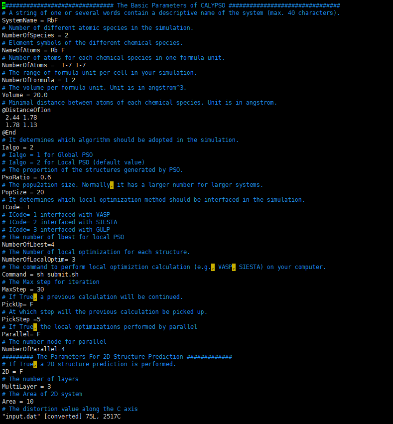
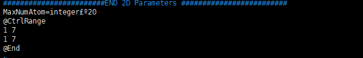

# Calypso 操作流程

## 一、结构搜索

### 1. 赝势准备（与VASP一致）

获取赝势文件夹PsePot（一般用pbe）

用法是：`cat POTCAR_1 POTCAR_2 …… POTCAR_n >> POTCAR`

注意：potcar合成时的顺序要与input.dat一致

### 2. 准备文件

需拷贝文件：

从Calypso安装路径下的example文件夹拷贝其中如下文件：

（1）input.dat

（2）INCAR_*（即所有INCAR文件，用于vasp多次从低精度到高精度优化，共四个）

（3）以及刚刚合成的POTCAR文件（注意名称只能为POTCAR，否则不识别）

（4）提交脚本（vasp.pbs）

```bash
#!/bin/bash
#PBS -N calypso
#PBS -l nodes=1:ppn=12
#PBS -j n
#PBS -e ${PBS_JOBNAME}.err
#PBS -o ${PBS_JOBNAME}.out

cd $PBS_O_WORKDIR
NP=`cat $PBS_NODEFILE|wc -l` #以上部分依照具体服务器修改

/share/apps/Calypso/calypso5.0/calypso_dev/Src/calypso.x > log2 2>&1
#依照具体的执行文件路径修改
```

以及脚本submit.sh：

```bash
#!/bin/sh
mpirun -n 12 /share/apps/VASP/V5.3.2/vasp5.3.2.std.impi > log1 2>/dev/null
```

路径部分改为具体路径

### 3. 编辑文件

#### （1）input.dat

基本见Calyspo中文手册第二章

前几项与化合物化学式有关的必改

体积按压力在这个网站搜寻，也可将两原子体积加和/2：
https://uspex-team.org/online_utilities/volume_estimation/

**原子间距：**

在组成所搜寻化合物的各元素的POTCAR里找到RCORE字段，其数值×0.529再乘0.6～0.8得到估计的数值再相加

顺序依次是：
- A-A  A-B
- B-A  B-B（A-B=B-A）

Popsize和Maxstep共同决定搜索结构的效率，设定的越高效率越低，但可使结果更精确。可依据具体需要酌情修改。

<div align="center">

</div>

**变组分预测：**（做定组分时这部分可以删掉）

如果没有该参数，添加：

MaxNumAtom=integer：在变组分结构预测中，模拟胞中所允许预测的最多原子数。

默认值：20

```
@CtrlRange
integer11 integer12   例如 1 3
integer21 integer22        1 3
@End
```

定义二元体系中每种元素的原子数变化的范围。对于A原子，x从integer11到integer12，而对于B原子，y从integer21到integer22。

默认值：1 6
       1 6

<div align="center">

</div>

**此处如果添加参数，会覆盖掉前面的NumberofAtoms参数使其失效。**

#### （2）INCAR文件，4个都要改

System local optimization

修改Target Pressure下方的数值，单位为kbar，1GPa = 10kbar，比如100GPa则数值修改为1000

### 4. 提交，查看及删除任务

**超算中心：**
- 提交：`bsub < u.lsf`
- 查看：`bjobs`
- 删除：`bkill 任务名`

**物理学院：**
- 提交：`qsub 脚本名`
- 查看：`qstat`
- 删除：`qdel 任务名`

### 5. 结果分析

在results文件夹里

- `cak.py` 产生结果分析文件，后缀为.dat
- `cak.py -m 精度 --vasp` 输出vasp格式文件
- `cak.py --cif` 输出cif图像文件

**Notes:** 如果跑完的很快并且产生一系列pso_sor, ini, opt文件，但是analysis文件里面全是NULL，注意看下vasp是否没有正确调用，一般修改vasp的执行文件路径即可