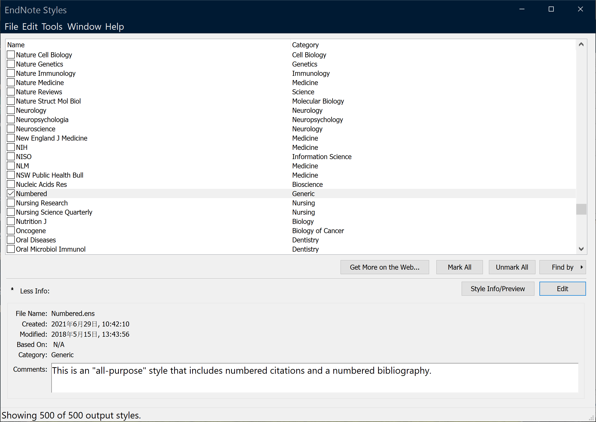

# EndNote 文献管理

林子越  

---

## 一、下载 EndNote 20

<https://www.isharepc.com/9496.html> （含安装教程）

以下内容均以 EndNote 20 为例。

---

## 二、导入文献到 EndNote


以 Google 学术为例，点击引用符号即可下载多种格式的文献。  
例如下载用于 EndNote 导入的 `*.enw` 文件，如图所示。


在 EndNote 20 中依次点击

```text
File → Import → File
```

即可导入刚才下载的 `.enw` 文件。  

若需批量导入文件夹，点击对话框中的文件夹图标即可。


---

## 三、编辑文献

选中文献后，在右侧 `Edit` 选项卡中编辑其信息。

> **注意**  
> 插入文献后需修改引用内容时，请务必在 EndNote 中修改，  
> 不要直接在 Word 中改写；否则更新引用时会被还原为 EndNote 中的原始信息。


---

## 四、插入文献

安装 EndNote 后，Word 会自动加载 EndNote 插件（如未出现请重新安装）。


1. 将光标放到需要插入文献的位置。  
2. 点击 `Insert Citation`，搜索关键词并选中目标文献（须已添加到库）。  

插入后，文献作者、题目等信息将自动在文档末尾生成。

---

## 五、编辑文献格式

1. 在 Word 中依次点击  

   ```text
   Tools → Output Styles → Open Style Manager…
   ```

   

2. 选择与需求相近的样式，或任选模板修改。此处以 `Numbered` 为例，点击 `Edit` 进入编辑界面。  

   

3. 常用可修改项  

   * **Bibliography → Layout**  
     调整参考文献起始格式，将标号改为常用的中括号数字。  
     

   * **Author Lists**  
     设定作者数量及“等”字样显示规则。  
     

   * **Author Name**  
     调整姓名顺序与格式。  

   * **Templates** — 调整字段顺序。常用模板：  

     ```text
     Generic
     Book
     Journal Article
     ```
     

4. 完成后执行  

   ```text
   File → Save As
   ```  

   将修改内容保存为新样式。

选择自定义样式后，点击 `Update Citations and Bibliography` 可一键更新整篇参考文献格式。

