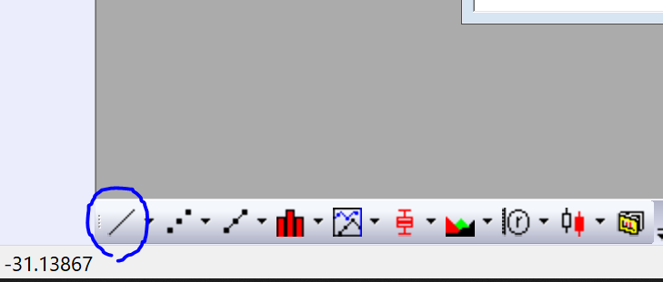
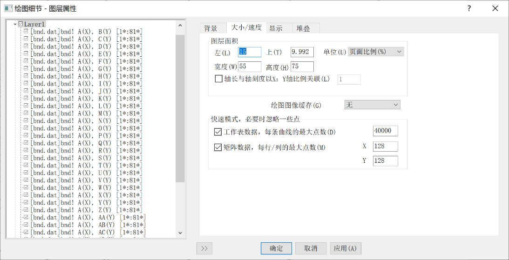
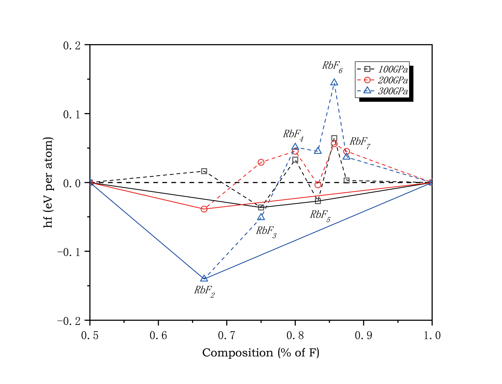

# Origin作图

**林子越**

## 一、Vasp作图

### 1. 能带

将bnd.dat导出到本地，拖入Origin

<div align="center">

</div>

<div align="center">

</div>

点击左下角折线图图标

<div align="center">

</div>

并选A列为X，B列之后为Y

右键选择应用设定到当前行及其下面所有行即可将下面的都选中，然后确定画图

画图之后双击坐标轴，开始进行修改

#### （1）刻度

水平起始设为0，结束设为x轴的最大值；

垂直方向上下范围依照图像范围设置

这个范围要与之后的DOS图的x轴的范围一致

水平主刻度选按自定义位置，这五个值是k插入的五个高对称点对应的值，

比如在syml文件中插入了5个高对称点，四个间隔中再每个插入20个k点

那么就将第一列的第1, 21, 41, 61, 81行的值输入到【位置】框中 – 如上图

垂直刻度自选，美观即可

#### （2）刻度线标签

下轴类型选择刻度索引字符串

<div align="center">

</div>

按顺序输入高对称点

X R M G R

左轴不变

格式：字体颜色自选

#### （3）标题

左轴文本改为E(eV)即可

<div align="center">

</div>

#### （4）轴线和刻度线

<div align="center">

</div>

下轴、右轴、上轴均显示轴线和刻度线，但主刻度和次刻度样式均选无

左轴保留刻度

#### （5）参照线

<div align="center">

</div>

参照线值的输入方式和刻度的自定义位置相同

输入后点击插入，然后点细节

<div align="center">

</div>

shift选中插入的线条，取消勾选自动格式，样式选实线，颜色选黑，粗细1.5即可

确定

<div align="center">

</div>

最后点击确定生效

#### （6）调整图线

首先点击右侧反锯齿图标使线条平滑

然后我们双击图中线条，选线条标签页，宽度设为1，确定

<div align="center">

</div>

#### （7）调整大小

双击图中空白处，选大小/速度标签页，可以调整左、上、宽度高度等位置大小属性

<div align="center">

</div>

<div align="center">

</div>

最后画好的的能带图如左图

### 2. 态密度

#### （1）态密度图

<div align="center">

</div>

导入DOS_total.dat

我们只用A列和B列画总态密度图

以A列为x轴B列为Y轴画图

画出图后如果要与能带图整合

<div align="center">

</div>

先点交换X-Y轴

之后的调整同能带图

如果需要填充效果，点选图线，勾选填充曲线之下的区域

<div align="center">

</div>

然后转到图案标签

选择适当的颜色或图案

<div align="center">

</div>

#### （2）能带-态密度图

现在我们合并图表

<div align="center">

</div>

<div align="center">

</div>

点选图-合并图表-打开对话框

排列设置里面行数设1，列数设2

并勾选用统一尺度设置图册高度

最后，通过调整图表大小，或用左右方向键调整，合并两图

### 3. 结合phonopy做声子谱图

将生成的band.dat拖入Origin

其他步骤与能带图完全相同，不同的是高对称点路径需要自己找

打开文件夹下的band.yml文件（直接使用vi编辑器或者xftp中记事本打开）

比如查找第二个高对称点0.5000000, 0.5000000, 0.5000000（注意格式）

在CentOS下:

```bash
# 在命令模式（进入后直接按shift+：）下输入
/xxx  # 这个是查找文件中"xxx"这个单词，是从文件上面到下面查找；
?xxx  # 这个是查找文件中"xxx"这个单词，是从文件下面到上面查找
```

在记事本中：

<div align="center">

</div>

通过查找高对称点获得下面的distance的值，这个值即为我们所需的高对称点的横坐标

之后步骤与做能带图相同

### 4. 结合phonopy做声子态密度图

将total_dos.dat拖入，做法与合并图表步骤与能带-态密度图相同

## 二、CASTEP画图

### 1. 能带图

输入命令：

```bash
Dispersion.pl -bs *.bands > *.txt  # 将其输出为可用于Origin作图的txt文件
```

用Xftp导出到本地。然后将*.txt拖入到Origin，直接获得作图数据

注意画图时查看.txt文件，2，3，4列这三列是K点一定不要拿来作图，从E列开始作图即可（E列为X轴，之后为Y轴）

关于高对称点的位置确定问题

首先找到高对称点对应的K点坐标（B，C，D列），这一行对应的E列的值即为高对称点在能带图X轴的横坐标。

如何减去费米能：在.castep文件中搜索fermi，得到的能量即为费米能。

其他步骤与之前相同

### 2. DOS图无区别

### 3. PDOS图第一列为X轴，其他Y轴

### 4. 声子谱图

```bash
dispersion.pl F.phonon > phonon.txt
```

然后画法同上面能带图，也要注意2，3，4列这三列是K点一定不要拿来作图

## 三、Quantum Espresso作图

### 1. 声子谱图

用输出的F.freq.gp作图，须注意QE输出的声子谱图是均匀的，高对称点位置取决于你一开始于高对称点之间插入的k点数目，

比如五个高对称点每个间隔之间插入20个k点，那么作图时就是第1,21,41,61,81行对应的F.freq.gp第一列数值，即为高对称点的X轴坐标。

### 2. 声子谱态密度

phdos.dat作图，无特别说明

## 四、Airss、run.pl作二元凸包/焓差图

画图主要需要提的有两点，连线和加标注（主要是不想用ps或者嫌麻烦的可用此法）

### 确定焓差：

两端可以是单质也可以是化合物

如果两端设为单质，纵坐标使用ca -m命令列出来的第四列靠右的值，该列值是自动计算出的每原子平均焓值，如果两端有化合物（两端为单质也可用此法）以左端为RbF，右端为单质F为例

对于RbF<sub>x</sub>

<div align="center">

</div>

总焓差：

<div align="center">

</div>

公式中所给的E是ca -m列出的第四列左边的值

平均原子焓差：总焓差/(1+x)

### 设置列值

<div align="center">

</div>

以Rb-F化物为例，

首先在第一列设置化合物中RbF<sub>x</sub>中F的个数，如果两个元素都在变则需要两列，F不在其中，设为1即可

第二列设置F在化合物中占比，

第三列C(Y)设为某压力点下ca -m列出的第四列左侧的焓值

D(Y)需要设置列值右键点击D(Y)-设置列值然后在以下框中输入：

<div align="center">

</div>

依照焓差公式输入相应的值即可

E到H列为其他压力点的计算

I到K列为凸包连线，ca -m列出的第六列显示加号的或者0.000的说明落在凸包图上

<div align="center">

</div>

把这些结构的焓值从焓值的一列复制到相应的I到K列

然后连线做凸包，打开 格式-页面属性-显示 打开下图对话框，选中跨缺失数据连接直线选项即可连线

<div align="center">

</div>

之后可通过双击图中直线更改线条样式粗细颜色等

<div align="center">

</div>

然后是做标注，最简单的方式就是复制右上角图例，然后边框选择无，再更改其中内容，或者点击左侧的插入文本

<div align="center">

</div>

最后的修图部分，双击线条，勾选 组-编辑模式-独立

符号-I到K列大小改为0

I到K线条设为实线，其他为虚线，都加粗

其他注意事项：输出的图片放到AI里，若想保存为eps格式，记得是把ai文件本身另存为eps格式，并非保存图片。

## 五、凸包图及相图

做法见上传的convex.opju 和 phase-diag.opgu

**Notes:**

相图采用浮动条形图的画法。Ctrl+左键可指定某一段浮动条形图的颜色

关于分段刻度做法：双击刻度即可看到如何取点