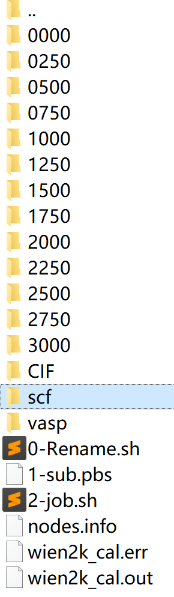
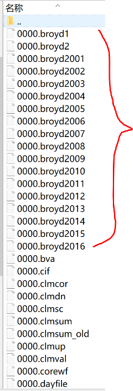
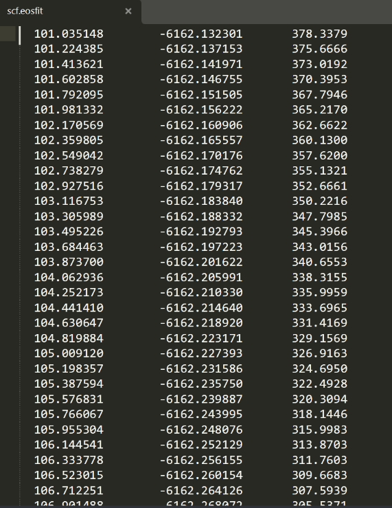

# Wien2k 赝势检测

## 一、结构优化

首先在当前目录新建文件夹，例如起名为vasp，在此文件夹中首先进行多压力点优化。（多压力点优化步骤见VASP的文档，本文档以vasp软件进行几何优化作预处理为例）

## 二、准备文件

0-Rename.sh, 1-sub.pbs, 2-job.sh三个脚本

（所有输入文件均在Wien2k_INPUT.rar中）

**chmod +x 0-Rename.sh, 2-job.sh** （赋予权限）

## 三、脚本内容

### 0-Rename.sh (依赖phonopy)

```bash
#!/bin/sh
#Edit by Linziyue
#本系列包含0，1，2三个脚本（按顺序），开始之前，需要在vasp文件夹内先计算多压力点优化，然后执行本脚本进行拷贝和格式转换
#注意，拷贝之后将cif文件名（压力）填补至同一位数，便于脚本进行处理，比如500，就改为0500
#脚本1，2中的循环也遵循以上规则
#最后输出的体积单位已转换为立方埃

if [ -d CIF ];then
rm -r CIF
fi
mkdir CIF

for i in 0 250 500 750 1000 1250 1500 1750 2000 2250 2500 2750 3000
#需要取的压力，单位为kbar
do
cp vasp/CONTCAR_$i CIF/
cd CIF/
phonopy -c CONTCAR_$i --symmetry --tolerance=0.01
rm BPOSCAR
mv PPOSCAR CONTCAR_$i
cabal poscar cif <CONTCAR_$i> CONTCAR_$i.cif
mv CONTCAR_$i.cif $i.cif
cd ..
echo "***********"
echo "Job Rename $i done"
echo "***********"
done

echo "*************"
echo "All Jobs Done"
echo "*************"
```

### 1-sub.pbs

```bash
#!/bin/bash
#Edit by Linziyue
#PBS -N wien2k_cal
#PBS -l nodes=1:ppn=12
#PBS -j n
#PBS -e ${PBS_JOBNAME}.err
#PBS -o ${PBS_JOBNAME}.out

cd $PBS_O_WORKDIR
NP=`cat $PBS_NODEFILE|wc -l`
cat $PBS_NODEFILE > nodes.info

for i in 0500 0750 1000 1250 1500 1750 2000 2250 2500 2750 3000
do
if [ -d "$i" ];then
rm -r $i
fi
mkdir $i
cp CIF/$i.cif $i;
cd $i ; cif2struct $i.cif

init_lapw1 << EOF
N
a
c
c
c
13
0.99
c
2000
0
c
n
EOF

sed -i "s/EF= 0.50000/EF= 2.0/" $i.in1
#这两行是否加上以及值的修改我还没有弄清楚，一般可以通过加上或去掉这两行来正常执行此脚本。（每个文件夹中正常输出broyd文件），了解如何修改此参数的同学欢迎与我进一步讨论。
sed -i "s/7.00/8.00/" $i.in1
run_lapw >1og 2>&1 &
cd ..
done
sleep 3m
```

### 2-job.sh

```bash
#!/bin/sh
#Edit by Linziyue
echo "Let's Rock"

if [ -f job.txt ];then
rm job.txt
fi

if [ -d scf ];then
rm -r scf
fi
mkdir scf

for i in 0500 0750 1000 1250 1500 1750 2000 2250 2500 2750 3000
do
cp $i/$i.scf scf/
echo "***********"
echo "Job $i done"
echo "***********"
done

echo "*************"
echo "All Jobs Done"
echo "*************"

cd scf
grepline :ENE '*.scf' 1 > scf.analysis
grepline :VOL '*.scf' 1 >> scf.analysis
#拷贝任意一个压力下的struct文件
cp ../3000/*.struct scf.struct

eplot_lapw << EOF
vol
0
B
EOF
```

## 四、提交脚本

**./0-Rename.sh**

<div align="center">

</div>

**qsub 1-sub.pbs**

<div align="center">

</div>

<div align="center">

</div>

**./2-job.sh**

输出结果如图所示，执行0-Rename后产生CIF文件夹。

提交1-sub.pbs后，每个压力点会输出一个文件夹，且应有较多的broyd文件。

执行2-job.sh后，会输出scf文件夹，需要画图的数据在此文件夹内。

用于画图的文件名为：scf.eosfit，如右图，其中第一列为体积，第三列为压强

压强单位为GPa, 体积换算为立方埃需要乘0.148187。

## 五、线性拟合

B-M状态方程E-V曲线拟合教程：

http://blog.sciencenet.cn/blog-3388193-1152915.html

点击工具-拟合函数生成器

如要对P-V状态方程拟合，表达式为：

x=(3/2)*B0*((V0/y)^(7.0/y)-(V0/y)^(5.0/3))*(1+(3.0/4)*(B1-4)*((V0/y)^(2.0/3)-1))

其中x为压强，y为体积；参数B0 B1 V0。

**注意：** 上面链接对应的博文目前处于屏蔽状态，无法访问B-M状态方程E-V曲线拟合教程的具体内容。如需查看相关教程，建议联系作者或查找其他资源。

# 上面链接失效，看下面的教程，只看拟合部分即可，AI时代建议使用python拟合

---

# Birch-Murnaghan 状态方程拟合 WIEN2k E-V 曲线教程

## 1. 引言

在基于密度泛函理论（DFT）的第一性原理计算中，通过计算一系列晶胞体积（V）下的总能量（E），可以得到一条能量-体积（E-V）曲线。Birch-Murnaghan 状态方程是一种广泛使用的经验公式，用于拟合这条 E-V 曲线，从而提取材料在绝对零度下的平衡物理性质，主要包括：

- **平衡体积 $V_0$**
- **平衡能量 $E_0$**
- **体弹模量 $B_0$** （Bulk Modulus，表征材料抵抗均匀压缩的能力）
- **体弹模量对压力的一阶导数 $B_0'$**

本教程将指导你完成从 WIEN2k 计算到最终拟合的整个过程。

## 2. 基本原理：Birch-Murnaghan 状态方程

最常用的形式是**三阶 Birch-Murnaghan 状态方程**，其表达式为：

$$
E(V) = E_0 + \frac{9V_0 B_0}{16} \left\{ \left[\left(\frac{V_0}{V}\right)^{\frac{2}{3}} - 1\right]^3 B_0' + \left[\left(\frac{V_0}{V}\right)^{\frac{2}{3}} - 1\right]^2 \left[6 - 4\left(\frac{V_0}{V}\right)^{\frac{2}{3}}\right] \right\}
$$

其中：

- $E(V)$ 是体积为 $V$ 时的总能量。
- $E_0$ 是基态平衡能量（拟合参数）。
- $V_0$ 是平衡体积（拟合参数）。
- $B_0$ 是平衡体弹模量（拟合参数，单位通常为 GPa）。
- $B_0'$ 是 $B_0$ 对压力的一阶导数（拟合参数，通常为 3.5-5 之间的无量纲数）。

**简化形式（二阶）**：当 $B_0'$ 固定为 4 ($B_0''=0$) 时，方程可简化为：
$$
E(V) = E_0 + \frac{9V_0 B_0}{16} \left[\left(\frac{V_0}{V}\right)^{\frac{2}{3}} - 1\right]^2 \left\{ 2 + \left[6 - 4\left(\frac{V_0}{V}\right)^{\frac{2}{3}}\right] \right\}
$$
二阶形式减少了一个拟合参数，在 $B_0'$ 接近 4 或数据点较少时更稳定，但精度可能稍低。通常建议使用三阶形式。

## 3. WIEN2k 计算步骤：生成 E-V 数据点

核心思路是：固定晶胞形状和原子位置，只均匀地缩放晶胞体积，在每个体积下进行自洽计算，并提取总能。

1. **创建初始结构**：使用 `structgen` 或从晶体数据库导入，创建一个你认为接近平衡的初始结构文件 (`.struct`)。
2. **体积缩放**：
   - 确定一组体积缩放系数（例如 0.94, 0.96, 0.98, **1.00**, 1.02, 1.04, 1.06）。
   - 对于每个缩放系数 $c$，使用以下命令缩放晶格常数：
     
     ```bash
     init_lapw -numax 7 -rkmax 7 -v 1.00 # 首先初始化原始结构
     ```
     
     **注意**：对于每个不同的体积，你都需要在一个**独立的目录**中进行计算，以避免文件冲突。
     
     ```bash
     # 假设你的初始结构在目录 ‘Fe_1.00’ 中
     mkdir ../Fe_$c
     cp *.def Fe_$c/
     cp *.struct Fe_$c/
     cd ../Fe_$c
     instgen_lapw // 使用 instgen_lapw 缩放结构，根据提示输入缩放系数 c
     # 或者手动编辑 .struct 文件中的晶格常数 (a, b, c)
     ```
3. **执行计算**：
   - 在每个体积对应的目录中，执行标准的 WIEN2k 自洽计算循环：
     
     ```bash
     init_lapw -b -v $c # 设置RKMAX等参数
     run_lapw -ec 0.0001 -i 100 # 执行SCF计算，设置收敛标准和最大迭代次数
     ```
   - 确保每个计算都达到能量收敛（检查 `case.scf` 最后一行 `:ENE` 的变化）。
4. **提取数据**：
   - 计算完成后，从每个目录的 `case.scf` 文件最后一行找到收敛的总能量（单位：Ry）。
   - 体积 $V$ 可以通过 `.struct` 文件中的晶格常数计算得到（单位：$a.u.^3$ 或 $\AA^3$，注意单位统一）。
   - 将数据整理成一个两列的文件（例如 `eV_data.dat`）：
     
     ```
     # Volume(a.u.^3)    Energy(Ry)
     150.0              -1000.12345
     155.0              -1000.23456
     160.0              -1000.34567
     ...
     ```

## 4. 拟合方法

### 方法一：使用 Python (`scipy.optimize.curve_fit`)

这是非常灵活且强大的方法。

```python
import numpy as np
import matplotlib.pyplot as plt
from scipy.optimize import curve_fit

# 1. 定义三阶B-M方程函数
def birch_murnaghan_3rd_order(V, E0, V0, B0, B0p):
    """
    V: 体积
    E0: 平衡能量
    V0: 平衡体积
    B0: 体弹模量 (GPa)
    B0p: B0的一阶导数
    Returns: Energy
    """
    # 将B0从GPa转换为Ry/(a.u.)^3或其他能量/体积单位，如果必要
    # 转换因子取决于你的单位制。
    # 例如：1 Ry = 13.6056980659 eV, 1 a.u.^3 = (0.529177)^3 A^3
    # 如果你的能量是Ry，体积是(a.u.)^3，B0的单位也是Ry/(a.u.)^3，则无需转换。
    # 但通常文献中B0报告为GPa，所以需要单位转换。
    # 单位转换因子 (1 Ry/Bohr^3 to GPa): 
    # 1 Ry/Bohr^3 = 14710.5076 GPa (近似值)
    # 因此，在函数内部，我们使用 B0_internal = B0 / 14710.5 来将输入的GPa值转换为计算所需的单位
    B0_internal = B0 / 14710.5 # 如果输入B0是GPa，能量是Ry，体积是Bohr^3

    eta = (V0 / V) ** (2/3)
    energy = E0 + (9 * V0 * B0_internal / 16) * (
                (eta - 1)**3 * B0p + 
                (eta - 1)**2 * (6 - 4 * eta)
            )
    return energy

# 2. 加载你的数据
data = np.loadtxt('eV_data.dat') # 确保文件没有注释行，或者使用 skiprows=1
V = data[:, 0]   # 第一列是体积
E = data[:, 1]   # 第二列是能量

# 3. 提供初始猜测值 [E0, V0, B0(GPa), B0p]
# 这非常重要！好的初始值能帮助拟合收敛。
# E0_guess: 数据中的最小能量
# V0_guess: 对应最小能量的体积
# B0_guess: 根据材料估算 (e.g., 铁~150 GPa, 金刚石~440 GPa)
# B0p_guess: 通常设为 4.0
initial_guess = [np.min(E), V[np.argmin(E)], 150, 4.0]

# 4. 执行拟合
popt, pcov = curve_fit(birch_murnaghan_3rd_order, V, E, p0=initial_guess, maxfev=8000)
# popt: 最优参数 [E0_opt, V0_opt, B0_opt, B0p_opt]
# pcov: 协方差矩阵，用于计算误差

# 5. 计算参数的标准误差
perr = np.sqrt(np.diag(pcov))

# 6. 输出结果
E0_opt, V0_opt, B0_opt_GPa, B0p_opt = popt
E0_err, V0_err, B0_err, B0p_err = perr

print("=== Birch-Murnaghan 3rd Order Fitting Results ===")
print(f"E0 = {E0_opt:.9f} ± {E0_err:.9f} (Ry)")
print(f"V0 = {V0_opt:.6f} ± {V0_err:.6f} (a.u.^3)")
print(f"B0 = {B0_opt_GPa:.6f} ± {B0_err:.6f} (GPa)")
print(f"B0' = {B0p_opt:.6f} ± {B0p_err:.6f}")

# 7. 绘制拟合曲线和数据点
V_fit = np.linspace(np.min(V), np.max(V), 1000)
E_fit = birch_murnaghan_3rd_order(V_fit, *popt)

plt.figure(figsize=(10, 6))
plt.scatter(V, E, color='blue', label='WIEN2k Data', s=20)
plt.plot(V_fit, E_fit, 'r-', label=f'B-M Fit: $B_0$={B0_opt_GPa:.2f} GPa')
plt.xlabel('Volume (a.u.$^3$)')
plt.ylabel('Energy (Ry)')
plt.legend()
plt.grid(True, alpha=0.3)
plt.title('E-V Curve Fitting with Birch-Murnaghan EOS')
plt.savefig('BM_fit.png', dpi=300)
plt.show()
```

**单位转换注意**：上述代码中的转换因子 `14710.5` 适用于能量为 **Ry**、体积为 **Bohr$^3$ (a.u.$^3$)** 的情况。如果你的数据单位不同（如 eV 和 $\AA^3$），需要使用不同的转换因子。这是拟合中最容易出错的地方之一。

### 方法二：使用 OriginLab 或 Gnuplot

这些图形化软件也支持非线性拟合。

1. **准备数据**：将 `V` 和 `E` 两列数据导入软件。
2. **输入方程**：在非线性拟合工具中，输入三阶 B-M 方程的公式。
   - **Origin**: 在 Fitting Function Organizer 中新建一个函数，输入类似下面的公式（变量为 x, 参数为 E0, V0, B0, B0p）：
     
     ```
     E0 + (9*V0*B0/16) * ( (((V0/x)^(2/3)-1)^3 * B0p ) + (((V0/x)^(2/3)-1)^2 * (6-4*(V0/x)^(2/3)) )
     ```
   - **Gnuplot**:
     
     ```gnuplot
     birch(x, E0, V0, B0, B0p) = E0 + (9*V0*B0/16) * ( (((V0/x)**(2./3.)-1)**3 * B0p ) + (((V0/x)**(2./3.)-1)**2 * (6-4*(V0/x)**(2./3.)) )
     ```
3. **设置初始参数**：与方法一中的 Python 代码类似，提供合理的初始猜测值（`E0≈E_min`, `V0≈V@E_min`, `B0≈100-200`, `B0p≈4.0`）。
4. **执行拟合**：运行迭代拟合，软件会自动找到最优参数及其误差。

## 5. 结果分析与验证

1. **图形检查**：始终绘制拟合曲线和原始数据点！确保曲线能很好地穿过数据点，特别是在最小值 ($V_0$) 附近。
2. **参数合理性**：
   - `$V_0$` 应该在你计算所用的体积范围内。
   - `$B_0$` 的值应该与你所研究材料的已知物理性质相符（查阅文献进行对比）。例如，普通金属的 $B_0$ 通常在 50-200 GPa 之间。
   - `$B_0'$` 通常在 3.5 到 5.5 之间。
3. **误差评估**：检查拟合软件给出的参数标准误差。如果某个参数的误差很大（例如，误差值与参数值本身大小相当），说明数据可能不足以准确确定该参数，或者初始猜测值太差。
4. **收敛性**：确保你的 WIEN2k 计算已经充分收敛（`k点网格`、`RKMAX`、`SCF`迭代），否则数据点的噪声会很大，影响拟合精度。

## 6. 常见问题与解决

- **拟合不收敛或结果离谱**：
  - **问题**：初始猜测值 `(p0)` 离真实值太远。
  - **解决**：提供更好的初始值。`V0` 和 `E0` 可以直接从数据中估计。`B0` 可以尝试一个合理的范围（50, 100, 150...）。
- **`B0` 的误差非常大**：
  - **问题**：数据点太少或体积范围太窄，无法约束 $B_0$（体弹模量是能量的二阶导数，对数据精度要求高）。
  - **解决**：增加更多的体积点进行计算，尤其是在平衡体积 $V_0$ 附近。
- **单位错误**：
  - **问题**：`B0` 拟合结果的值是 0.01 或 几百万，完全不合理。
  - **解决**：**仔细检查并统一所有单位**（能量、体积），并在方程中进行正确的单位换算。这是最常见的问题！

通过以上步骤，你就可以从 WIEN2k 的计算结果中可靠地提取出材料的平衡性质了。